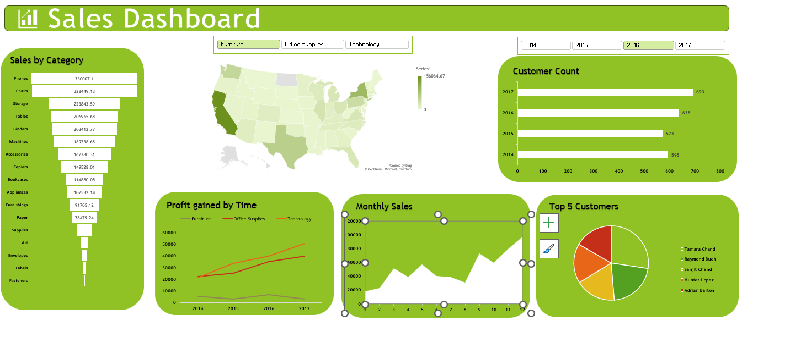

# 📊 Superstore Sales Analysis in Excel Dashboard

## 📌 Project Overview
This project contains a sales dataset and an interactive Excel dashboard built to analyze and visualize sales performance. The dashboard helps in understanding key business metrics and trends using PivotTables, charts, and slicers.

## 🔍 Key Insights
- Total Sales and Profit overview  
- Sales by Category and Sub-Category  
- Regional performance analysis  
- Monthly/Yearly sales trends  
- Interactive filtering using slicers  

## 🛠 Tools Used
- Microsoft Excel

## 📷 Dashboard Preview

## 📂 Files in this Repository
- Sales Dashboard (1).xlsx  
- salesdata.xlsx  
- dashboard.png.png  

## 📈 How to Use
1. Download the file **Sales Dashboard (1).xlsx**
2. Make sure **salesdata.xlsx** is in the same folder
3. Open the dashboard file in Excel
4. Use slicers and filters to explore the data
